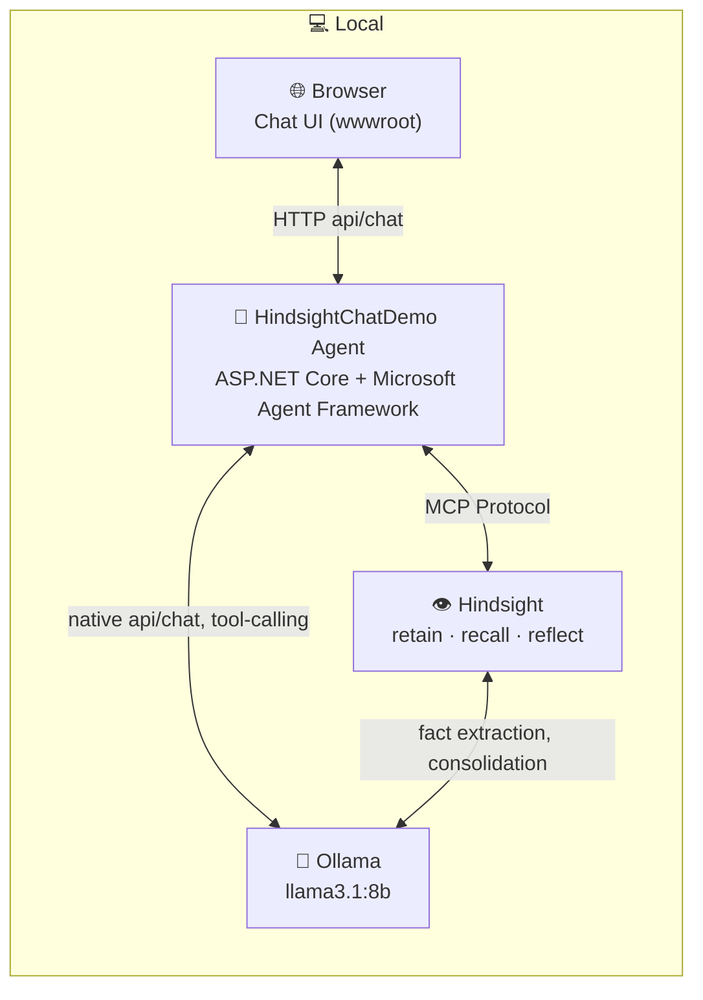

# Hindsight Chat Demo

A minimal .NET 9 chat app that demonstrates [Hindsight](https://hindsight.vectorize.io), an
open-source agent-memory system, in a customer-support scenario. An agent built with
[Microsoft Agent Framework](https://github.com/microsoft/agent-framework) uses Hindsight's
three core operations during a conversation — with every tool call surfaced live in the UI:

- `retain` — writes a durable fact to memory.
- `recall` — reads back one specific fact in a later, unrelated session.
- `reflect` — combines multiple facts, observations, and past conversations into a single
  synthesized answer (e.g. "how has this customer's experience been overall?").

## Architecture

Everything runs locally — no cloud LLM, no external API keys.



- The **agent** (`applications/HindsightChatDemo/`) is the only piece with custom code. It
  holds the conversation, decides — via the LLM's tool calls — when to invoke `retain`,
  `recall`, or `reflect`, and returns both the reply and the tool-call log to the browser.
- **Ollama** serves two different consumers with the same local model: the agent's own
  chat/tool-calling loop, and Hindsight's internal fact-extraction pipeline (see
  `HINDSIGHT_API_LLM_MODEL` in `docker-compose.hindsight.yml`).
- **Hindsight** is reached over MCP (Model Context Protocol), not a REST call — the agent
  discovers `retain`/`recall`/`reflect` as tools through the MCP session at startup.

## Prerequisites

- .NET 9 SDK
- Docker (for Hindsight)
- [Ollama](https://ollama.com), running locally, with a tool-calling model pulled
  (default: `llama3.1:8b`)

## Quick start

```bash
git clone https://github.com/ozkank/hindsight-chat-demo.git
cd hindsight-chat-demo

docker compose -f docker-compose.hindsight.yml up -d   # starts Hindsight (API/MCP :8888, Admin UI :9999)
cd applications/HindsightChatDemo
dotnet run                                              # starts the app, prints the listening port
```

Open the printed URL in a browser. `GET /api/health` reports whether both Hindsight and the
agent are up.

## Configuration

Everything is driven by `appsettings.json` — no URLs or model names are hardcoded.

| Key | Description |
|---|---|
| `Ollama:BaseUrl` | Ollama's native API address (no `/v1` — see below) |
| `Ollama:Model` | Must match `HINDSIGHT_API_LLM_MODEL` in `docker-compose.hindsight.yml` |
| `Ollama:Temperature` | Lower values noticeably improve tool-call reliability (see below) |
| `Hindsight:McpEndpoint` | `{bankId}` is replaced with `Hindsight:BankId` |
| `Hindsight:BankId` | Hindsight memory namespace; all sessions in this demo share one, so `recall` in a new session can find what `retain` wrote in a previous one |

### Why the native Ollama API, not the OpenAI-compatible one

The OpenAI-compatible `/v1` endpoint on this project's original test setup (Ollama 0.32.5)
returned tool calls as malformed text inside `content` instead of a structured `tool_calls`
field — the model was calling `retain`/`recall` correctly, but the response format wasn't
recognized as a tool call. Ollama's native `/api/chat` endpoint handled the same request
correctly, so the app connects through
[OllamaSharp](https://github.com/awaescher/OllamaSharp)'s `OllamaApiClient` instead of the
OpenAI SDK. If a newer Ollama version fixes the compat layer, swap it back in
`applications/HindsightChatDemo/Services/HindsightAgentService.cs`.

## Project layout

```
docker-compose.hindsight.yml                          Hindsight (API + MCP + Admin UI, persistent volume)
applications/HindsightChatDemo/Program.cs              Minimal API: /api/chat, /api/health, /api/config
applications/HindsightChatDemo/Models/ChatModels.cs     Request/response DTOs
applications/HindsightChatDemo/Services/HindsightAgentService.cs  MCP connection, agent construction, session management
applications/HindsightChatDemo/Services/ToolCallRecorder.cs       Captures retain/recall/reflect calls per request (AsyncLocal)
applications/HindsightChatDemo/system_message.txt       Agent system prompt (retain/recall/reflect rules)
applications/HindsightChatDemo/wwwroot/                 Chat UI (vanilla HTML/JS/CSS)
explainer/                                             Standalone Jupyter notebooks (no LLM tool-calling in the loop)
```

`POST /api/chat` takes `{ message, userId, sessionId }` and returns
`{ message, toolCalls, sessionId }`, where `toolCalls` lists every retain/recall/reflect
invoked while handling that request — this is what the UI renders as a memory-activity tag
under each message. Sessions are held in memory per process (no database); starting a new
session gets a fresh `AgentSession` but keeps the same Hindsight `bankId`.

## Known limitations

Tool-call reliability with small local models is sensitive to the model, the temperature,
and message framing. Three models were tested with the same battery of prompts (single-fact
`retain`, fresh-session `recall`, fresh-session `reflect`, each repeated 3-4 times):

| Model | `retain` | `recall` | `reflect` fires | `reflect` stays in Turkish |
|---|---|---|---|---|
| `llama3.2:latest` (3B) | reliable | unreliable | unreliable | n/a |
| `qwen2.5:latest` (7B) | reliable | unreliable (~1/8) | reliable | unreliable (leaked Chinese) |
| `llama3.1:8b` (current default) | reliable | reliable (3/3) | reliable (3/3) | reliable (3/3) |

`llama3.1:8b` was the clear winner and is the current default. It is noticeably slower per
reply than `qwen2.5` (occasionally near a minute), which is an acceptable trade-off for a
live demo. `Ollama:Temperature` at `0.3` measurably helped all three models.

Even with `llama3.1:8b`, complex or multi-fact messages (e.g. a complaint and an address
change in one sentence) are less reliable than a single, clearly-stated fact — keep demo
messages to one fact per turn. And `reflect`'s synthesized answer is sometimes generic
rather than grounded in the specific stored fact, even when the tool call itself succeeds.

For a live demo, treat the memory-activity tag as the artifact of record; the model's prose
around it may occasionally be imperfect.

## Demo script

See [DEMO.md](DEMO.md) for the presentation scenario and a pre-demo checklist.

## Quickstart notebook

[`explainer/`](explainer/) has a Jupyter notebook using the official `hindsight-client`
Python package — same structure as
[Hindsight's own quickstart](https://github.com/vectorize-io/hindsight-cookbook), with
our own example. It calls `retain`/`recall`/`reflect` directly with no LLM deciding when
to use them, so every run behaves the same way. Good as a "how the engine works" primer
before the live chat demo — see [explainer/README.md](explainer/README.md).
